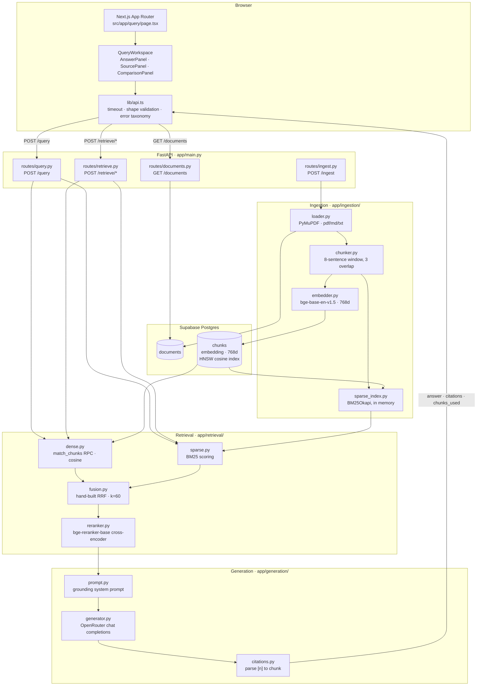

# HybridRAG

**A retrieval-augmented generation system that runs dense vector search and BM25 keyword search in parallel, fuses both ranked lists with hand-built Reciprocal Rank Fusion, reranks with a cross-encoder, and generates answers cited back to the exact source chunks.**

Pure vector search fails on exact terms. Error codes, product IDs, acronyms and schema identifiers do not embed distinctively, so a query containing `match_chunks` or `pgvector` gets smeared into its semantic neighbourhood and the right chunk never surfaces. Pure keyword search fails in the opposite direction: rephrase the question and the token overlap disappears. Most RAG implementations pick one and quietly accept the blind spot.

HybridRAG runs both and fuses the results, and the repository carries the measurements to show what that buys. On a 30-query ground truth set, moving from dense-only to hybrid raises Recall@5 from **73.3% to 90.0%** and MRR from **0.5846 to 0.7163**. The evaluation section below also documents where hybrid does *not* win, because a benchmark you only publish when it flatters you is not a benchmark.

---

## Badges


> Versions above are taken from `backend/requirements.txt` and `frontend/package.json`. The repository does not pin a Python version or declare a Node `engines` range.

> No `LICENSE` file is present in the repository. See [License / Author](#license--author).

---

## Demo

<!-- Add screenshot: the /query workspace mid-request, showing the five-stage pipeline indicator with the elapsed timer -->
<!-- Suggested filename: docs/screenshots/query-loading.png -->

<!-- Add screenshot: a completed answer with amber [n] citation markers in the answer panel and the matching chunk highlighted in the Evidence panel on the right -->
<!-- Suggested filename: docs/screenshots/answer-with-citations.png -->

<!-- Add screenshot: the Retrieval comparison panel with Dense vs Hybrid run on the same query, showing chunks badged "in both" and "only here" -->
<!-- Suggested filename: docs/screenshots/dense-vs-hybrid.png -->

<!-- Add screenshot: the homepage hero with the Three.js pipeline visualisation -->
<!-- Suggested filename: docs/screenshots/homepage-hero.png -->

---

## Table of Contents

- [Architecture Overview](#architecture-overview)
- [How It Works (Pipeline Walkthrough)](#how-it-works-pipeline-walkthrough)
- [Tech Stack](#tech-stack)
- [Evaluation Results](#evaluation-results)
- [Project Structure](#project-structure)
- [Getting Started](#getting-started)
- [API Reference](#api-reference)
- [Interactive Demo Features](#interactive-demo-features)
- [Design System](#design-system)
- [Known Limitations and Non-Goals](#known-limitations-and-non-goals)
- [What I'd Improve Next](#what-id-improve-next)
- [License / Author](#license--author)

---

## Architecture Overview



> **Note:** the Product Requirements Document specifies Anthropic Claude for generation. The shipped implementation calls **OpenRouter's chat completions endpoint** via the `openai` SDK (`app/generation/generator.py`), configured by `LLM_MODEL_NAME`. The diagram reflects the code, not the plan.

<!-- Add diagram: no docs/architecture-diagram.png exists in the repo. The Mermaid block above renders natively on GitHub, so a static image is optional. -->

---

## How It Works (Pipeline Walkthrough)

### Indexing (runs once per document)

**1. Load.** `ingestion/loader.py` accepts `.pdf`, `.txt` and `.md`. PDFs go through PyMuPDF page by page; everything else is read as UTF-8. Runs of three or more newlines collapse to two. An unsupported extension raises rather than silently producing empty text, and `ingest_folder` catches per-file failures so one corrupt document cannot abort a batch.

**2. Chunk.** `ingestion/chunker.py` implements sentence-window chunking: text is split on paragraph then sentence boundaries, and grouped into overlapping windows of **8 sentences with 3 sentences of overlap** (step size 5). Fixed-character splitting cuts facts in half at arbitrary offsets; overlapping sentence windows guarantee that a fact spanning a boundary still appears intact in at least one chunk. Windows shorter than 50 characters are merged backwards into the previous chunk rather than being stored as fragments.

**3. Embed.** `ingestion/embedder.py` loads `BAAI/bge-base-en-v1.5` through `sentence-transformers` and encodes with `normalize_embeddings=True`, producing unit-length 768-dimension vectors. Normalising at write time means cosine similarity reduces to a dot product at query time. The model is cached in a module global so it loads once per process.

Running embeddings locally is a deliberate cost decision: indexing and every subsequent query would otherwise incur per-token embedding API charges, and the corpus would have to leave the host. The only paid call in the entire system is generation.

**4. Store.** Vectors land in `chunks.embedding vector(768)` behind an HNSW index on `vector_cosine_ops`. BM25 is built separately, in memory, by `ingestion/sparse_index.py` over the same chunk set.

### Query (runs per request)

**5. Dense retrieval.** `retrieval/dense.py` embeds the incoming query with the same model and calls the `match_chunks` Postgres function, returning the top N by cosine similarity. This is what makes paraphrased questions work: query and chunk need to mean the same thing, not share tokens.

**6. Sparse retrieval.** `retrieval/sparse.py` tokenises to lowercase, strips punctuation, drops single characters, and scores every chunk with `BM25Okapi`. Chunks scoring zero are discarded before sorting. Rare exact tokens score highly here precisely because they are rare, which is the property dense embeddings destroy.

Both searches run over the identical chunk set, so a chunk only has to be found by one of the two methods to reach the context window.

**7. Reciprocal Rank Fusion.** `retrieval/fusion.py` implements RRF by hand:

```python
score(chunk) = Σ 1 / (k + rank_i)   for each list i containing the chunk,  k = 60
```

The obvious alternative, a weighted sum `α·dense + (1-α)·bm25`, does not work here. Cosine similarity is bounded on `[0, 1]`; BM25 is unbounded on `[0, ∞)` and its scale shifts with query length and corpus statistics. Combining them requires per-query min-max normalisation, which is unstable on small candidate sets. RRF operates on positions instead of scores, making it scale-invariant and robust to the single parameter it does have. It was written directly rather than pulled from a library because it is nine lines of arithmetic and because being able to explain the fusion step is the point of the project.

The fused output preserves `dense_rank` and `sparse_rank` per chunk, which is what lets the frontend show *why* a chunk surfaced.

**8. Cross-encoder reranking.** `retrieval/reranker.py` re-scores the fused shortlist with `BAAI/bge-reranker-base`, which reads query and chunk together in a single forward pass rather than comparing two independently computed vectors. Top-k survive and become the context window. The measured result on this corpus was that reranking *did not* improve over plain RRF. See [Evaluation Results](#evaluation-results).

**9. Grounded generation.** `generation/prompt.py` numbers the surviving chunks `[1]…[k]` and injects them into a system prompt that instructs the model to answer only from that context and cite chunk numbers in brackets. Out-of-corpus questions produce a fixed refusal string rather than a plausible guess. `generation/generator.py` sends this to OpenRouter and raises a typed `GenerationError` when the provider returns no choices or an empty message.

**10. Citation mapping.** `generation/citations.py` regex-extracts `[n]` markers from the answer, deduplicates them in order of first appearance, bounds-checks each index against the context window, and maps it back to the chunk at that position, carrying `chunk_id`, `doc_id`, full text and `reranker_score`.

**11. Response and rendering.** The API returns `answer`, `citations` (the subset actually cited, with full text) and `chunks_used` (every chunk the generator received, text truncated to 200 characters). The frontend merges the two in `lib/sources.ts` so cited chunks show full text while uncited ones are explicitly labelled as previews. `lib/answer.ts` parses the answer into blocks and turns each `[n]` into an interactive control wired to its chunk with `aria-controls`, so the citation-to-evidence relationship works for screen readers too. A marker that resolves to nothing is rendered flagged rather than silently dropped.

---

## Tech Stack

### Backend (`backend/requirements.txt`)

| Technology | Version | Why this choice |
| --- | --- | --- |
| **FastAPI** | `0.115.0` | Pydantic request validation for free, and automatic OpenAPI docs at `/docs` for a reviewer poking at the API |
| **Uvicorn** | `0.30.6` | Standard ASGI server; the `[standard]` extra brings the websocket and reload tooling |
| **pydantic-settings** | `2.4.0` | Typed settings loaded from `.env` with defaults in one place (`app/config.py`) rather than scattered `os.getenv` calls |
| **python-dotenv** | `1.0.1` | Local `.env` loading for scripts run outside the app context |
| **PyMuPDF** | `1.25.3` | Fast, dependency-light PDF text extraction with per-page access, no Java or system binaries |
| **sentence-transformers** | `>=3.0.0` | Runs both the bi-encoder and the cross-encoder locally, which removes per-query embedding cost entirely |
| **supabase** | `>=2.0.0` | Postgres, pgvector and the RPC interface behind one managed client; one datastore instead of a separate vector DB |
| **rank-bm25** | `>=0.2.2` | In-memory BM25Okapi. Chosen over Postgres FTS so the ranking function is inspectable and tunable in Python |
| **openai** | `>=1.0.0` | Used as an OpenRouter client; the OpenAI-compatible schema means swapping providers is a base URL and a model id |

### Frontend (`frontend/package.json`)

| Technology | Version | Why this choice |
| --- | --- | --- |
| **Next.js** | `16.3.1` | App Router with server components; the marketing pages render statically while the workspace stays client-side |
| **React** | `19.2.8` | Required by Next 16; `useSyncExternalStore` is used for media-query subscriptions |
| **TypeScript** | `^5` | The API contract is expressed as explicit types in `lib/types.ts` with no `any` in the response path |
| **Tailwind CSS** | `^4.3.3` | v4 `@theme` puts the design tokens in CSS custom properties, so the same values drive utilities and raw SVG |
| **@tailwindcss/postcss** | `^4.3.3` | The v4 PostCSS bridge |
| **Three.js** | `^0.186.0` | The hero pipeline visualisation; lazy-loaded into its own chunk and skipped entirely on mobile and reduced-motion |
| **Anime.js** | `^4.5.0` | Pipeline stage indicator, boot screen sequence, How It Works panel transitions |
| **Motion** | `^13.3.0` | `MotionConfig reducedMotion="user"` plus the query result entrance transition |
| **ESLint** | `^9` + `eslint-config-next@16.3.1` | Flat config; `react-hooks/set-state-in-effect` is enforced, not suppressed |

---

## Evaluation Results

Source of truth: [`backend/eval/results.md`](backend/eval/results.md). Ground truth set: [`backend/eval/eval_set.json`](backend/eval/eval_set.json), 30 queries, split exactly 15 `exact_term` and 15 `paraphrase`. Harness: [`backend/eval/run_eval.py`](backend/eval/run_eval.py), which retrieves the top 20 candidates for every mode and computes Recall@{1,3,5,10} and MRR against the expected chunk id.

The tables below are reproduced verbatim from `results.md`.

### Overall Results (All 30 Queries)

| Retrieval Mode         | Recall@1   | Recall@3   | Recall@5   | Recall@10  | MRR        |
| -----------------------|------------|------------|------------|------------|----------- |
| **Dense (pgvector)**   | 0.4667     | 0.6000     | 0.7333     | 0.8000     | 0.5846     |
| **Sparse (BM25)**      | 0.6000     | 0.7000     | 0.8000     | **0.9667** | 0.6877     |
| **Hybrid (RRF)**       | **0.6000** | **0.8000** | **0.9000** | 0.9333     | **0.7163** |
| **Hybrid + Reranker**  | 0.5333     | 0.7000     | 0.8667     | 0.9333     | 0.6628     |

### Breakdown: Exact-Term Queries (15 Queries)

| Retrieval Mode         | Recall@1   | Recall@3   | Recall@5   | Recall@10  | MRR        |
| -----------------------|------------|------------|------------|------------|----------- |
| **Dense (pgvector)**   | 0.4667     | 0.6667     | 0.8000     | 0.8000     | 0.6158     |
| **Sparse (BM25)**      | **0.7333** | **0.8667** | 0.8667     | **1.0000** | **0.8058** |
| **Hybrid (RRF)**       | **0.7333** | 0.8000     | **0.9333** | **1.0000** | 0.8044     |
| **Hybrid + Reranker**  | 0.6000     | 0.8000     | **0.9333** | **1.0000** | 0.7284     |

### Breakdown: Paraphrase / Semantic Queries (15 Queries)

| Retrieval Mode         | Recall@1   | Recall@3   | Recall@5   | Recall@10  | MRR        |
| -----------------------|------------|------------|------------|------------|----------- |
| **Dense (pgvector)**   | 0.4667     | 0.5333     | 0.6667     | 0.8000     | 0.5533     |
| **Sparse (BM25)**      | 0.4667     | 0.5333     | 0.7333     | **0.9333** | 0.5695     |
| **Hybrid (RRF)**       | **0.4667** | **0.8000** | **0.8667** | 0.8667     | **0.6281** |
| **Hybrid + Reranker**  | **0.4667** | 0.6000     | 0.8000     | 0.8667     | 0.5972     |

### Interpretation

**Where hybrid wins.**

The number that matters operationally is Recall@5, because the generator receives the top 5 chunks. Dense-only puts the correct chunk in that window **73.3%** of the time; hybrid raises it to **90.0%**. That is a 16.7 point absolute gain, and it cuts context-omission failures by roughly 62%. Overall MRR moves from `0.5846` to `0.7163`, a 22.5% relative improvement, meaning the correct chunk is not merely present but ranked higher in what the model reads first.

The mechanism is visible in the breakdowns. On exact-term queries, BM25 alone reaches `0.8058` MRR and perfect Recall@10 while dense tops out at `0.6158` MRR and `0.8000` Recall@10: this is the vocabulary-mismatch tax, dense embeddings blurring rare identifiers like `RLS`, `pgvector` and `match_chunks` into their neighbourhoods. Hybrid inherits almost all of BM25's exact-term precision (`0.8044` MRR, within `0.0014` of sparse). On paraphrase queries, where literal token overlap is absent, hybrid scores the highest MRR of any mode at `0.6281`, beating both dense (`0.5533`) and sparse (`0.5695`). Fusion is not splitting the difference between the two methods; it is taking the better of each.

**Where hybrid does not win.**

Two honest caveats.

First, **sparse beats hybrid on Recall@10 overall**, `0.9667` against `0.9333`. Fusion's rank-based scoring can push a chunk that only one method found below the cutoff when the other method ranked it poorly. At the k that actually matters for generation, k=5, hybrid is clearly ahead, but at k=10 pure BM25 recovers slightly more.

Second, and more interesting: **cross-encoder reranking made things worse on this corpus.** Hybrid + Reranker scored `0.6628` MRR against pre-rerank hybrid's `0.7163`, while adding several seconds of CPU inference per query. Two reasons, from the writeup:

- **Domain bias.** `bge-reranker-base` is trained largely on MS MARCO-style conversational and web passages. Against dense engineering specifications and architecture tables it sometimes preferred longer narrative chunks over concise factual definitions.
- **Candidate density.** On a corpus of roughly 48 chunks, RRF already places the right candidate in the top 1 to 3. Reranking at that point mostly introduces the risk of demoting a correct result.

The reranker remains in the `/query` path because it is part of the architecture the project set out to build and because the result flips on larger corpora, but on this corpus the defensible production choice would be pre-rerank hybrid RRF: equal or better accuracy at zero additional inference latency.

> **Reproducing these numbers:** `run_eval.py` **overwrites `results.md`** with its own auto-generated format. The committed `results.md` is a hand-written analysis built on top of that output, so re-running the harness will destroy the written analysis. Copy the file elsewhere first if you intend to re-run it.

---

## Project Structure

```text
.
├── backend/
│   ├── app/
│   │   ├── main.py                  # FastAPI app, CORS, error-envelope middleware, router wiring
│   │   ├── config.py                # pydantic-settings: models, RRF k, top-n/top-k defaults
│   │   ├── db/
│   │   │   ├── schema.sql           # documents + chunks tables, HNSW + GIN indexes
│   │   │   └── supabase_client.py   # lazily constructed service-role client
│   │   ├── ingestion/
│   │   │   ├── loader.py            # pdf/txt/md extraction, whitespace normalisation
│   │   │   ├── chunker.py           # sentence-window chunking, 8 sentences / 3 overlap
│   │   │   ├── embedder.py          # bge-base-en-v1.5, normalised 768d vectors
│   │   │   ├── sparse_index.py      # BM25Okapi index built in memory over all chunks
│   │   │   └── pipeline.py          # ingest_file / ingest_folder orchestration
│   │   ├── retrieval/
│   │   │   ├── dense.py             # match_chunks RPC, cosine similarity
│   │   │   ├── sparse.py            # BM25 scoring, zero-score chunks dropped
│   │   │   ├── fusion.py            # hand-built RRF, keeps dense_rank / sparse_rank
│   │   │   └── reranker.py          # bge-reranker-base cross-encoder
│   │   ├── generation/
│   │   │   ├── prompt.py            # grounding system prompt, numbered context block
│   │   │   ├── generator.py         # OpenRouter call, raises typed GenerationError
│   │   │   └── citations.py         # parses [n] markers back to source chunks
│   │   └── routes/
│   │       ├── health.py            # GET  /health
│   │       ├── ingest.py            # POST /ingest        (operator only)
│   │       ├── retrieve.py          # POST /retrieve/{dense,sparse,hybrid,reranked}
│   │       ├── query.py             # POST /query         (full pipeline)
│   │       └── documents.py         # GET  /documents     (doc_id to title lookup)
│   ├── eval/
│   │   ├── eval_set.json            # 30 (query, expected_chunk_id) pairs, 15 exact / 15 paraphrase
│   │   ├── run_eval.py              # recall@k + MRR across all 4 modes, OVERWRITES results.md
│   │   └── results.md               # benchmark tables + hand-written analysis (source of truth)
│   ├── scripts/
│   │   ├── ingest.py                # CLI: python -m scripts.ingest <file-or-folder>
│   │   ├── dump_chunks.py
│   │   └── test_*.py                # manual smoke scripts per stage, not a pytest suite
│   ├── corpus/                      # demo corpus (gitignored)
│   ├── requirements.txt
│   └── .env.example                 # NOTE: stale, see Getting Started
└── frontend/
    ├── src/
    │   ├── app/
    │   │   ├── layout.tsx           # fonts, SEO metadata, AppShell, header/footer
    │   │   ├── page.tsx             # homepage: hero, how it works, evaluation, creators
    │   │   ├── query/page.tsx       # the query workspace
    │   │   ├── privacy/page.tsx
    │   │   ├── terms/page.tsx
    │   │   ├── globals.css          # Tailwind v4 @theme design tokens
    │   │   ├── icon.svg             # favicon: two retrieval paths converging on one node
    │   │   ├── apple-icon.tsx       # generated 180x180 touch icon
    │   │   └── opengraph-image.tsx  # generated 1200x630 OG card
    │   ├── components/
    │   │   ├── workspace/
    │   │   │   ├── QueryWorkspace.tsx    # orchestrates query state and all panels
    │   │   │   ├── QueryInput.tsx        # Enter submits, Shift+Enter newline, clear/reset
    │   │   │   ├── PipelineIndicator.tsx # 5-stage Anime.js indicator + real elapsed timer
    │   │   │   ├── AnswerPanel.tsx       # renders answer, interactive [n] citation markers
    │   │   │   ├── SourcePanel.tsx       # evidence cards, highlight + scroll on citation click
    │   │   │   ├── ComparisonPanel.tsx   # dense vs sparse vs hybrid vs reranked, side by side
    │   │   │   └── StateMessage.tsx      # single presentation for every error/empty state
    │   │   ├── home/                     # homepage sections
    │   │   ├── site/                     # header, footer, boot screen, pipeline visuals
    │   │   └── legal/LegalPage.tsx
    │   ├── lib/
    │   │   ├── types.ts             # exact API response types, documents known caveats
    │   │   ├── api.ts               # fetch + abort timeout + runtime shape validation
    │   │   ├── answer.ts            # answer parser, [n] markers to interactive citations
    │   │   ├── sources.ts           # merges chunks_used with citations
    │   │   ├── evaluation.ts        # typed access to generated eval data
    │   │   └── config.ts            # env-driven API base URL, timeout, query limits
    │   └── data/eval-results.json   # generated from backend/eval/results.md
    ├── scripts/sync-eval-results.mjs # regenerates the above; never hand-edit the JSON
    ├── package.json
    └── .env.local.example
```

---

## Getting Started

### Prerequisites

- Python, with `venv` available. No version is pinned in the repository
- Node and npm, at a version that satisfies `next@16.3.1`
- A Supabase project, or any Postgres with the `vector` extension available
- An OpenRouter API key, for the generation call in `app/generation/generator.py`

### 1. Clone

```bash
git clone https://github.com/Shayan-Bhowmik/RAG-Pipeline-With-Hybrid-Search.git
cd RAG-Pipeline-With-Hybrid-Search
```

### 2. Install backend dependencies

```bash
cd backend
python -m venv .venv
```

```bash
# Windows
.venv\Scripts\activate
# macOS / Linux
source .venv/bin/activate
```

```bash
pip install -r requirements.txt
```

> The embedding and reranker models are pulled from the Hugging Face Hub on first use by `sentence-transformers`, not vendored in the repository. Expect the first query after a cold start to spend time loading them.

### 3. Set up the database

In the Supabase SQL editor, run [`backend/app/db/schema.sql`](backend/app/db/schema.sql). It enables `pgvector` and creates the `documents` and `chunks` tables with an HNSW cosine index and a GIN index on the generated `tsvector` column.

> **Missing piece:** `app/retrieval/dense.py` calls a Postgres RPC named `match_chunks`, but no definition for it exists anywhere in this repository. `schema.sql` creates the tables and indexes only. You will need to create that function in your database before dense retrieval will work. It is called with `query_embedding` and `match_count`, and its rows are read as `id`, `doc_id`, `text`, `page_or_section` and `similarity`.

### 4. Configure the backend environment

Create `backend/.env`. These are the variables **`app/config.py` actually reads**:

| Variable | Required | Description |
| --- | --- | --- |
| `SUPABASE_URL` | yes | Supabase project URL |
| `SUPABASE_SERVICE_ROLE_KEY` | yes | Service-role key. Server-side only, bypasses RLS, never exposed to the browser |
| `OPENROUTER_API_KEY` | yes | OpenRouter key for the generation call |
| `LLM_MODEL_NAME` | no | Generation model. Default `nvidia/nemotron-3-ultra-550b-a55b:free` |
| `EMBEDDING_MODEL_NAME` | no | Default `BAAI/bge-base-en-v1.5` |
| `RERANKER_MODEL_NAME` | no | Default `BAAI/bge-reranker-base` |
| `RRF_K` | no | RRF constant. Default `60` |
| `TOP_N_RETRIEVAL` | no | Candidates per retrieval route. Default `20` |
| `TOP_K_RERANKED` | no | Chunks passed to the generator. Default `5` |

> **`backend/.env.example` is out of date.** It lists `ANTHROPIC_API_KEY`, which no code reads, and omits `LLM_MODEL_NAME`. Use the table above.

### 5. Ingest a corpus

`backend/corpus/` is listed in `.gitignore`, so a fresh clone contains no documents. Create the folder and add your own `.pdf`, `.txt` or `.md` files, then point the ingestion CLI at it:

```bash
python -m scripts.ingest ./corpus
```

Pointing at a directory ingests every supported file and rebuilds the BM25 index at the end. Pointing at a single file skips that rebuild, so sparse retrieval will not see the new chunks until the server restarts.

> Ingestion is **additive, not idempotent**. Re-ingesting the same file duplicates its chunks. Clear the `documents` and `chunks` tables before re-ingesting.

### 6. Run the backend

```bash
python -m uvicorn app.main:app --reload --port 8000
```

Interactive API docs: `http://localhost:8000/docs`

### 7. Install and run the frontend

```bash
cd ../frontend
npm install
```

Create `frontend/.env.local`:

| Variable | Required | Description |
| --- | --- | --- |
| `NEXT_PUBLIC_BACKEND_URL` | yes in production | FastAPI origin, no trailing slash. Read in the browser, so it must be reachable from the visitor's network. Falls back to `http://localhost:8000` in development only |
| `NEXT_PUBLIC_SITE_URL` | no | Public origin of the site, used to build absolute Open Graph image URLs |

```bash
npm run dev
```

Open `http://localhost:3000`. The workspace is at `/query`.

> CORS in `app/main.py` is pinned to `http://localhost:3000`. Add your deployed origin to `allow_origins` before shipping.

### 8. Run the evaluation harness

```bash
cd ../backend
python eval/run_eval.py
```

> This **overwrites `backend/eval/results.md`**, replacing the hand-written analysis with the auto-generated tables. Back it up first.

### 9. Sync eval numbers into the frontend

```bash
cd ../frontend
npm run sync:eval
```

Parses `backend/eval/results.md` into `src/data/eval-results.json`, which the homepage Evaluation section renders. The JSON is generated; never edit it by hand.

---

## API Reference

All request and response models are declared inline in the route modules. There is no `models/schemas.py`.

### `GET /health`

```json
{ "status": "ok" }
```

### `POST /query`

Full pipeline: dense + sparse retrieval, RRF, rerank, grounded generation, citation mapping.

```python
class QueryRequest(BaseModel):
    question: str
    top_n: int = 10   # candidates per retrieval route
    top_k: int = 5    # chunks passed to the generator
```

**200 response.** `citations` contains only the chunks the model actually cited, with full text. `chunks_used` contains every chunk the generator received, in reranked order, with text truncated to 200 characters. Position `i` in `chunks_used` corresponds to citation marker `[i+1]`.

```json
{
  "query": "What is reciprocal rank fusion?",
  "answer": "<generated answer containing [n] citation markers>",
  "retrieval_mode": "hybrid",
  "citations": [
    {
      "citation_index": 1,
      "chunk_id": "<chunk uuid>",
      "doc_id": "<document uuid>",
      "text": "full chunk text",
      "page_or_section": null,
      "reranker_score": 0.0
    }
  ],
  "chunks_used": [
    {
      "chunk_id": "<chunk uuid>",
      "doc_id": "<document uuid>",
      "text": "first 200 characters of the chunk",
      "reranker_score": 0.0
    }
  ],
  "model": "nvidia/nemotron-3-ultra-550b-a55b:free"
}
```

**400** on an empty or whitespace-only question:

```json
{ "detail": { "error": "Query cannot be empty.", "code": "empty_query" } }
```

**502** when retrieval succeeded but the model call did not:

```json
{ "detail": { "error": "The answer could not be generated. Please try again.", "code": "generation_failed" } }
```

**500** for any unhandled error, returned by `ErrorEnvelopeMiddleware`, which sits inside the CORS layer so error responses keep their CORS headers:

```json
{ "error": "The service hit an unexpected error.", "code": "internal_error" }
```

### `POST /retrieve/dense` · `POST /retrieve/sparse` · `POST /retrieve/hybrid` · `POST /retrieve/reranked`

Retrieval only, no generation. Note the request field is `query`, not `question`.

```python
class RetrieveRequest(BaseModel):
    query: str
    top_n: int = 10
```

```json
{
  "query": "reciprocal rank fusion",
  "method": "hybrid",
  "results": [
    {
      "chunk_id": "<chunk uuid>",
      "doc_id": "<document uuid>",
      "text": "chunk text",
      "page_or_section": null,
      "score": 0.0,
      "rrf_score": 0.0,
      "dense_rank": 1,
      "sparse_rank": 1
    }
  ]
}
```

Fields by mode:

| Mode | `score` | `rrf_score` | `dense_rank` / `sparse_rank` | `reranker_score` |
| --- | --- | --- | --- | --- |
| `dense` | cosine similarity | not returned | not returned | not returned |
| `sparse` | BM25 (unbounded) | not returned | not returned | not returned |
| `hybrid` | carried over, not comparable | yes | yes | not returned |
| `reranked` | carried over, not comparable | yes | yes | yes |

On `hybrid` and `reranked`, `score` is inherited from whichever list first contributed the chunk and is **not comparable across modes**. The frontend deliberately renders only the score each mode genuinely produces.

### `GET /documents`

Maps document UUIDs to titles. Retrieval results carry only `doc_id`, so the frontend uses this to label source chunks with a filename instead of a UUID.

```json
{
  "documents": [
    { "doc_id": "<document uuid>", "title": "<document filename without extension>" }
  ]
}
```

### `POST /ingest`

Operator only. Takes a path on the **server's** filesystem; this is not a file upload endpoint. Per the Security and Access document it should be excluded from any public deployment or placed behind an API key.

```python
class IngestRequest(BaseModel):
    path: str   # file or directory on the server
```

```json
{ "docs_processed": 0, "total_chunks": 0, "skipped": [] }
```

A single file returns `{ "doc_id": "<document uuid>", "chunks_stored": <int> }` instead.

---

## Interactive Demo Features

### Dense vs Hybrid comparison

Below every answer, the workspace exposes a comparison panel that re-runs the same question against any two of the four real retrieval routes and lists both result sets side by side. This is the fastest way to see the hybrid advantage on live data rather than taking the benchmark on trust.

To use it: run a query, scroll to **Retrieval comparison**, leave the default **Dense** vs **Hybrid**, and press **Run comparison**.

Each chunk is badged **in both** or **only here**, with the overlap count stated above the columns. Because the hybrid response carries `dense_rank` and `sparse_rank` per chunk, a chunk badged `only here` on the hybrid side shows which single route found it. A chunk carrying a sparse rank but no dense rank is one BM25 surfaced and dense missed, promoted into the context window by fusion. That is the mechanism behind the Recall@5 gain in the table above, observable on a single query.

Every mode shows only the score it genuinely returns: cosine for dense, BM25 for sparse, RRF plus both source ranks for hybrid, cross-encoder score for reranked. Nothing is normalised into a fake common scale.

### Citation-to-evidence linking

Citation markers in the answer are real controls, not styled text. Selecting one highlights the matching evidence card, scrolls it into view, and expands it to full text. The relationship is exposed through `aria-controls` and `aria-current`, and the active state is carried by a left rail plus an explicit "selected" label rather than colour alone.

### Pipeline indicator

While a query is in flight the workspace walks through the five real backend stages. It states plainly that it is a visual indicator rather than backend telemetry, because the API returns a single response at the end and reports no per-stage progress. The elapsed timer beside it is genuinely measured in the browser.

---

## Design System

Implemented in [`src/app/globals.css`](frontend/src/app/globals.css) as Tailwind v4 `@theme` tokens, so the same custom properties drive utility classes and the raw SVG in the architecture diagram.

### Colour

| Token | Value | Role |
| --- | --- | --- |
| `--color-bg` | `#0b0e14` | Page background. Near-black, not pure black |
| `--color-surface` | `#12161f` | Cards and panels |
| `--color-surface-raised` | `#171c27` | Active/selected evidence cards |
| `--color-surface-sunken` | `#090c11` | Recessed sections |
| `--color-border` | `#222836` | Default hairline borders |
| `--color-border-strong` | `#2e3545` | Hover and emphasis borders |
| `--color-fg` | `#e6e8ec` | Primary text |
| `--color-fg-muted` | `#8a8f98` | Body copy |
| `--color-fg-faint` | `#5c626d` | Metadata and mono labels |
| `--color-accent` | `#5b8cff` | Primary actions, focus rings, links |
| `--color-citation` | `#f5a623` | Citation markers, cited chunks, the Answer node |
| `--color-dense` | `#5b8cff` | Dense retrieval route |
| `--color-sparse` | `#2db6a6` | Sparse retrieval route |
| `--color-both` | `#3fbf7f` | Chunks found by both modes in the comparison |
| `--color-danger` | `#e5484d` | Errors, unmatched citations |

The Frontend Specification called for a `#7C6FFF` purple secondary. It was dropped in favour of a single blue accent plus semantic hues, and every semantic colour is always paired with a text label so no state is carried by colour alone.

### Typography

**Inter** for UI and body, **JetBrains Mono** for technical metadata, both via `next/font/google` and self-hosted at build time. Monospace is reserved for things that are literally identifiers: chunk IDs, endpoint paths, scores, model names, parameter values. If it is mono on this site, it is a real value from the system.

### Layout and motion

1100px max content width. A consistent 6px card radius, compact rectangular controls, no pill shapes. The workspace is a two-column grid at `lg` and above with the answer column sticky, so a citation and its chunk stay readable together; below that it stacks with a collapsible evidence panel.

Every animation is additive and reduced-motion aware. `MotionConfig reducedMotion="user"` covers the Motion tree; Anime.js and Three.js code check `prefers-reduced-motion` directly; a global media query collapses CSS durations. The Three.js hero is lazy-loaded, pauses when scrolled out of view, and is replaced entirely by a static SVG diagram on narrow viewports and for reduced-motion visitors.

---

## Known Limitations and Non-Goals

These were scoped out deliberately, per the PRD's non-goals, not left undone.

- **No multi-turn conversational memory.** Single-shot Q&A only. Each query is independent; there is no history.
- **No authentication and no multi-tenancy.** One corpus, one workspace, no accounts. Access control is at the infrastructure layer: the frontend talks only to the backend, and the service-role key never reaches the browser.
- **No document upload.** `POST /ingest` takes a path on the server's own filesystem. There is no upload path on the website and no per-visitor corpus isolation.
- **No embedding or LLM fine-tuning.** Off-the-shelf models throughout.
- **Text only.** No image or audio document support.
- **`page_or_section` is always null.** The column exists in the schema and ships in every API response, but `chunker.py` never populates it. The UI renders it only when present, which in practice means never.
- **Sparse retrieval is in-memory and rebuilt at startup.** The `tsvector` column and GIN index exist in `schema.sql` but no code queries them; BM25 runs in the Python process. This does not survive horizontal scaling.
- **Ingestion is not idempotent.** No filename or content hash dedupe, so re-ingesting duplicates chunks.
- **Generation latency is the bottleneck.** `frontend/src/lib/config.ts` sets the client abort to 180 seconds and records why: the configured generation model measured between 60 and 120 seconds per query, so a shorter limit cancelled requests that would have succeeded. The PRD's sub-5-second target needs a faster generation model, not pipeline changes.
- **No automated test suite.** `backend/scripts/test_*.py` are manual smoke scripts, not pytest.

---

## What I'd Improve Next

**Move BM25 into Postgres.** The `tsvector` column and GIN index are already in the schema, unused. Moving sparse retrieval into the database removes the in-memory index entirely, which is what currently prevents running more than one backend process and forces a full rebuild on every restart. The tradeoff is losing the ability to inspect and tune the ranking function in Python, which was worth keeping while the retrieval behaviour was still being validated.

**Batch the reranker, or drop it by default.** Cross-encoder inference on CPU is the second-largest latency cost and, on this corpus, it measurably *hurt* ranking quality. The honest next step is to make reranking opt-in via a request flag, keep the `/retrieve/reranked` route for comparison, and revisit it on a corpus large enough for the candidate density argument to reverse.

**A semantic cache on the query path.** Embedding the incoming query and checking for a near-duplicate against recent queries would let repeat and near-repeat questions skip retrieval and generation entirely. Given that generation dominates latency and is the only paid call, this is the highest-leverage optimisation available.

**ColBERT-style late interaction as a fourth eval arm.** Token-level late interaction sits between bi-encoder speed and cross-encoder accuracy, and would be a fairer comparison against the cross-encoder than the current binary rerank-or-not. It was explicitly deferred in the PRD, and the eval harness is already structured to accept another mode.

**Populate `page_or_section`.** PyMuPDF already exposes per-page text in `loader.py`, but the page index is discarded before chunking. Threading it through would let citations point at a page rather than a UUID, which is the single largest gap in the evidence UI.

**Fix ingestion idempotency.** Hash file contents at ingest and skip or replace on match, so re-running the pipeline cannot silently duplicate chunks and skew the eval numbers.

---

## License / Author

No `LICENSE` file is currently present in this repository. Add one before publishing; without it the default is all-rights-reserved, which is probably not the intent for a portfolio project.

**Built by**

| | |
| --- | --- |
| **Shayan Bhowmik** | [LinkedIn](https://www.linkedin.com/in/shayan-bhowmik-227808321/) · [GitHub](https://github.com/Shayan-Bhowmik) |
| **Govind Nair** | [LinkedIn](https://www.linkedin.com/in/govind-nair-93495032a/) · [GitHub](https://github.com/govindhere06-code) |

<!-- Add portfolio links here if either author has one; none were found in the repository -->

Repository: [Shayan-Bhowmik/RAG-Pipeline-With-Hybrid-Search](https://github.com/Shayan-Bhowmik/RAG-Pipeline-With-Hybrid-Search)
